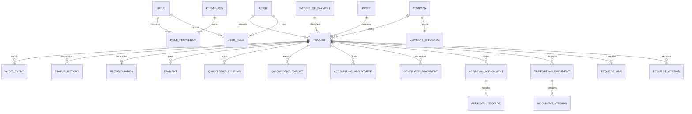

# Data model

All monetary columns use `Decimal(19,4)`. Master data is deactivated instead of destructively removed. Request versions contain snapshots. Approval assignments and decisions carry the request version. Generated artifacts use unique `(request, type, version)` constraints and SHA-256 hashes.

